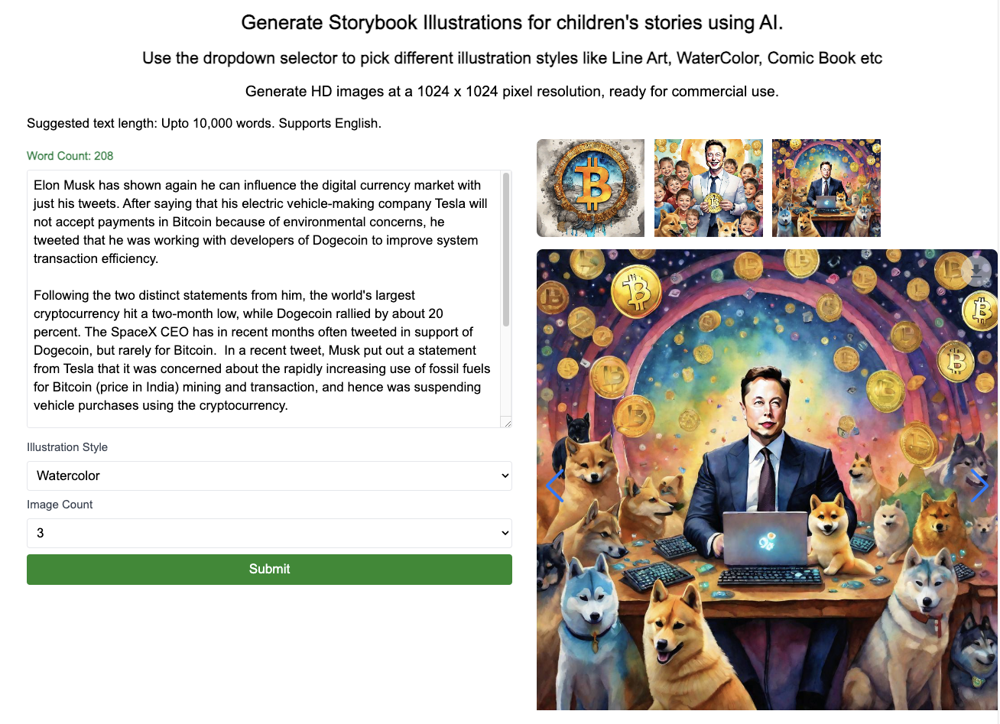

This is a [Next.js](https://nextjs.org/) project to generate storybook illustrations from any text.

Sample UI and output can be seen here:



## Getting Started

Find a detailed blog post here: Generate [Storybook Illustrations](https://medium.com/@ramsrigoutham/generate-kids-story-illustrations-with-ai-in-just-1-click-programmatically-full-tutorial-eea0d60ee848)


Register for two API services [Segmind](https://www.segmind.com/) and [OpenAI](https://platform.openai.com/)

Set two environmental variables  eg: In .env.local

OPENAI_API_KEY=sk-xxxx

SEGMIND_API_KEY=SG_xxxxx

Then, run the development server:

```bash
npm run dev
# or
yarn dev
# or
pnpm dev
# or
bun dev
```

Open [http://localhost:3000](http://localhost:3000) with your browser to see the result.

The main files that you need to look at are `app/page.tsx` for the UI and `app/api/generate-story-illustrations\route.ts` for the API.

